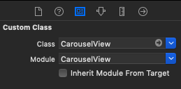

# CarouselView for iOS

Use this component for a page selector in your application.

## Prerequisites

- iOS 11.0
- Swift 5

## Installation

### Carthage

[Carthage](https://github.com/Carthage/Carthage) is a decentralized dependency manager that builds your dependencies and provides you with binary frameworks.

You can install Carthage with [Homebrew](http://brew.sh/) using the following command:

```bash
$ brew update
$ brew install carthage
```

To integrate Vouchers Module into your Xcode project using Carthage, specify it in your `Cartfile`:

```ogdl
git "https://git.4all.com/multiservices/components/carouselCollectionView-ios"
```

Run `carthage update` to build the framework and drag the built `CarouselView.framework` into your Xcode project.

On your application targets’ Build Phases settings tab, click the + icon and choose New Run Script Phase. Create a Run Script in which you specify your shell (ex: `/bin/sh`), add the following contents to the script area below the shell:

```
/usr/local/bin/carthage copy-frameworks
``` 

Add the paths to the frameworks you want to use under “Input Files". For example:

```
$(SRCROOT)/Carthage/Build/iOS/CarouselView.framework
```

# Usage

To use all methods below import the CarouselView in your files.

```
import CarouselView
```

## Adding CarouselView to your view

Now you can include the `CarouselView` wherever you want your Carousel to appear. Just **be sure that you pass a `dataSource` to the CarouselView**.

```
    var carouselView: CarouselView! {
        didSet {
            carouselView.dataSource = self
            carouselView.delegate = self
        }
    }
```

Also, feel free to add it in your storyboard and create an `@IBOutlet`, you will just need to set it's class on your Identity Inspector, as shown in the image below:



With this approach, your initialization would look, for example, like this:

```
    @IBOutlet weak var carouselView: CarouselView! {
        didSet {
            carouselView.dataSource = self
            carouselView.delegate = self
        }
    }
```

## CarouselView data source

There are two methods in the `CarouselView`'s data source, both of them are required.

public protocol CarouselViewDataSource: AnyObject {
    
``` 
    /// Defines the number of items which will be presented on Carousel View.
    ///
    /// - Parameter carouselView: DataSource's CarouselView
    /// - Returns: The number of items.
    func numberOfItems(inCarouselView carouselView: CarouselView) -> Int
    
    /// This function will call the equivalent function of UICollectionViewDataSource. Use it as if you were using a UICollectionView.
    ///
    /// - Parameters:
    ///   - carouselView: CarouselView requesting the cell.
    ///   - indexPath: IndexPath that speciefies the item's location.
    /// - Returns: A configured CarouselViewCell
    func carouselView(_ carouselView: CarouselView, cellForItemAt indexPath: IndexPath) -> CarouselViewCell
```

## CarouselView delegate

There are two methods in the `CarouselView`'s delegate, both of them are optional.

```
    /// Tells the delegate that the item at the specified index was selected.
    /// The carousel view calls this method when the user successfully selects an item in the carousel view. It does not call this method when you programmatically set the selection.
    ///
    /// - Parameters:
    ///   - carouselView: CarouselView that notifies the selection.
    ///   - index: Int for the row of the selected item.
    func carouselView(_ carouselView: CarouselView, didSelectItemAt index: Int)
    
    /// Tells the delegate that the current page did change.
    ///
    /// - Parameter pageIndex: Index for the new current page.
    func didChangeCurrentPage(pageIndex: Int)
```

## CarouselView public methods

- `func carouselSetup(_ animated: Bool)` Set the page control and scroll to the initial cell. This function must be called when all data that will be presented on carousel is loaded. *Important: If you don't call this method the page control and the initial scroll will not happen*

You can call this function at the end of your api request or even at `viewDidLayoutSubviews`, as shown in the example below:

```
    override func viewDidLayoutSubviews() {
        super.viewDidLayoutSubviews()
        
        carouselView.carouselSetup(true)
    }
```

- `func reloadData()` Reload Carousel View data.

- `func register(_ nib: UINib?, forCellWithReuseIdentifier identifier: String)` Register a cell to be used.

- `func registerNib(for cellClass: CarouselViewCell.Type)` Register a cell to be used. The difference in this method is it uses the Class name to register your cell more easily. *Important: Your `CarouselViewCell` identifier must be the same as you XIB's name for this to work*

- `func dequeueReusableCell(withReuseIdentifier identifier: String, for indexPath: IndexPath) -> CarouselViewCell?` Dequeue reusable cell to be used in an specific Index Path.

- `func dequeueReusableCell<T: CarouselViewCell>(for indexPath: IndexPath) -> T?` Dequeue reusable cell to be used in an specific Index Path. The difference in this method is it uses Generics and the class name to register your cell more easily. *Important: Your `CarouselViewCell` identifier must be the same as you XIB's name for this to work*

## CarouselView reusable cell

When creating a cell for using in the `CarouselView`, you need to inherit from `CarouselViewCell`.

## CarouselView configuration parameters

`CarouselView` has are several parameters that can be set. Here is the list of them:

- `dataSource` Carousel content's data source protocol.

- `delegate` Carousel content's delegate protocol.

- `animationType` Carousel's scroll animation type. Default: none 
  *Obs.: All of the types are exemplified in a section below*

- `itemSpacingDistance` Distance between each cell. Default: 20

- `itemSize` Size of each cell. Default: CGSize(width: 210, height: 300)

- `sideItemScale` Size of the side cells compared to the main cell size. Default: 0.6
  *Obs.: This will only be used if the animation type is `scale`*

- `sideItemTranslation` Translation of the side cell compared to the main cell. Default: 20
  *Obs.: This will only be used if the animation type is `translation`*

- `firstCellIndex` Initial cell index. Default: 0

- `currentPageIndicatorTintColor` Page indicator UIColor for current page. Default: darkGray

- `pageIndicatorTintColor` Page indicator tint color. Default: lightGray

- `scrollDirection` UICollectionView's Scroll direction. Default: horizontal

- `isPageControlHidden` Hides the page control. Default: false


## CarouselView animations

`CarouselView` has three different animations, depending on the value you set on `animationType`.

- `none` This is the default collection view scroll.


- `scale` This animation scales the side cells in relation to the main cell. Configure the scale with `sideItemScale` parameter.


- `translation` This animation translates the side cells in relation to the main cell. Configure the translation with `sideItemTranslation` parameter.

